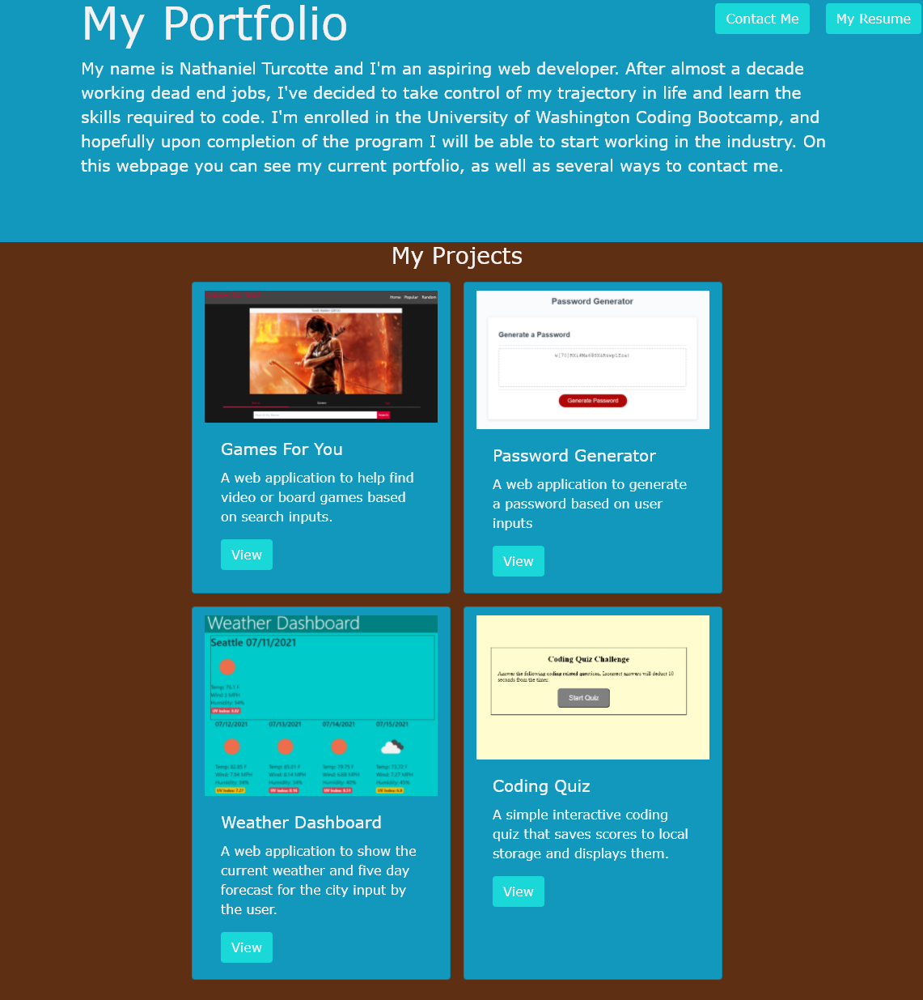
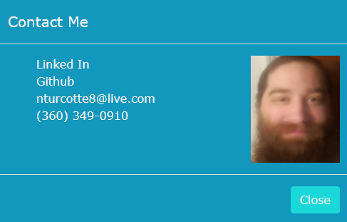
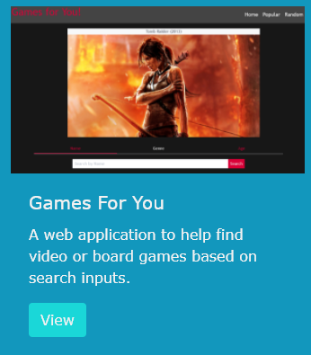
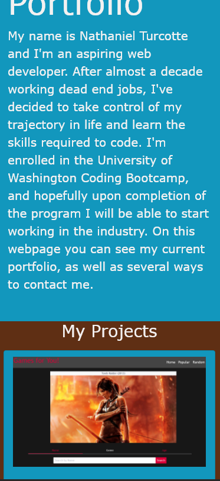

# Update Portfolio

## Hosted at: https://thehebi.github.io/updated-portfolio/

### Technologies used:
<a href="https://getbootstrap.com/docs/4.6/getting-started/introduction/" target="_blank">Bootstrap 4.6</a>

#### The purpose of this project was to update my portfolio. I chose to start from scratch rather than changing my original portfolio because I wanted to update it with Bootstrap to make it more modern and mobile friendly. My portfolio now shows my four most recent projects, as well as having my resume and contact information at the top of the page.

#### Clicking on the "Contact Me" button at the top of the screen will open a modal with my contact information. Here you will find a link to my LinkedIn profile, my Github profile, my phone number, my email, and my headshot as well.

#### The cards containing my project information all have a screenshot from the project, the name of the project, a short description of the project, and a view button. Clicking on this button will take you to the deployed application.

#### My portfolio has also been formatted to be more mobile friendly as well.

Copyright <YEAR> <COPYRIGHT HOLDER>

Permission is hereby granted, free of charge, to any person obtaining a copy of this software and associated documentation files (the "Software"), to deal in the Software without restriction, including without limitation the rights to use, copy, modify, merge, publish, distribute, sublicense, and/or sell copies of the Software, and to permit persons to whom the Software is furnished to do so, subject to the following conditions:

The above copyright notice and this permission notice shall be included in all copies or substantial portions of the Software.

THE SOFTWARE IS PROVIDED "AS IS", WITHOUT WARRANTY OF ANY KIND, EXPRESS OR IMPLIED, INCLUDING BUT NOT LIMITED TO THE WARRANTIES OF MERCHANTABILITY, FITNESS FOR A PARTICULAR PURPOSE AND NONINFRINGEMENT. IN NO EVENT SHALL THE AUTHORS OR COPYRIGHT HOLDERS BE LIABLE FOR ANY CLAIM, DAMAGES OR OTHER LIABILITY, WHETHER IN AN ACTION OF CONTRACT, TORT OR OTHERWISE, ARISING FROM, OUT OF OR IN CONNECTION WITH THE SOFTWARE OR THE USE OR OTHER DEALINGS IN THE SOFTWARE.